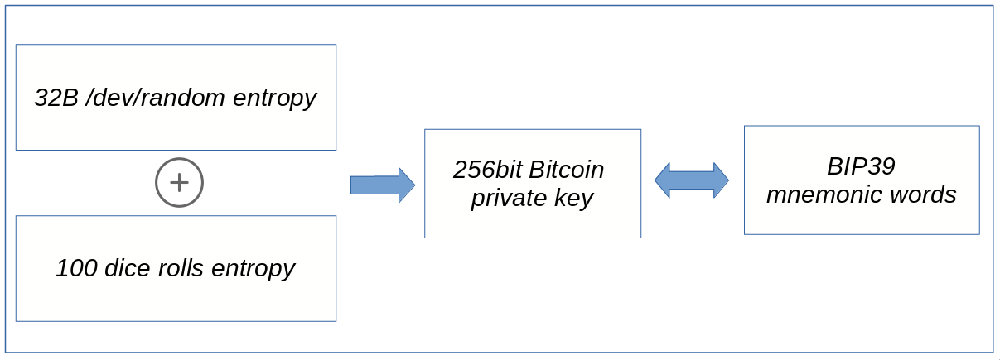

## Groestldice

**Generating Groestlcoin private key and BIP39 mnemonic words using dice**

### Overview of generating the groestlcoin seed and mnemonic words

---

### Works on Windows, Mac and linux

<pre>
git clone https://github.com/Groestlcoin/groestldice.git
npm install
npm start
</pre>

<pre>
running tests
mocha tests/run_test.js
</pre>
